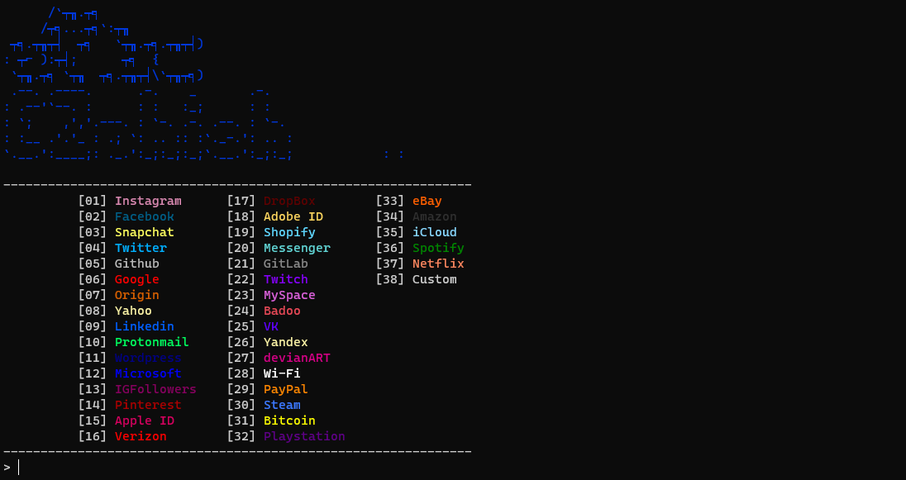

# Phishing Script - EZphish

## Description

This repository contains a phishing script named EZphish, designed to demonstrate phishing attacks against various popular websites. The script is written in C and Python and is intended for educational and testing purposes only.

## How to Use

Follow the steps below to set up and use the EZphish script:

### Setup

1. Clone this repository to your local machine using command:
`git clone https://github.com/WholeL0ttaDumbSh1tH4D0cKz/Ezphish`
2. Make sure you have the required dependencies installed:
   - Python
   - Flask
   - pyngrok
   - C compiler (gcc)

3. within VAL.json change the value of ngrok_APIKEY to your ngrok account api key

### Running the Main Script

1. Navigate to the root directory of the project.
2. run command `gcc main.c -o main`

3. Run the main script using the command:
./main
## Supported Sites
- Adobe
- Amazon
- Badoo
- Bitcoin
- Devianart
- Dropbox
- Facebook
- GitHub
- GitLab
- Google
- iCloud
- InstaFollowers
- Instagram
- LinkedIn
- Messenger
- Microsoft
- MySpace
- Netflix
- Origin
- PayPal
- Pinterest
- PlayStation
- ProtonMail
- Shopify
- Shopping
- Snapchat
- Spotify
- Steam
- Twitch
- Twitter
- Verizon
- VK
- Wi-Fi
- WordPress
- Yahoo
- Yandex

--and maybe more to come

## Disclaimer

This script is for educational and testing purposes only. Do not use it for illegal activities or to harm others. The creators of this script are not responsible for any misuse or damage caused by it.

## License

This project is licensed under the [MIT License.

## HELP AND SUPPORT
If any problems with this script contact me via discord: h4d0ckz
